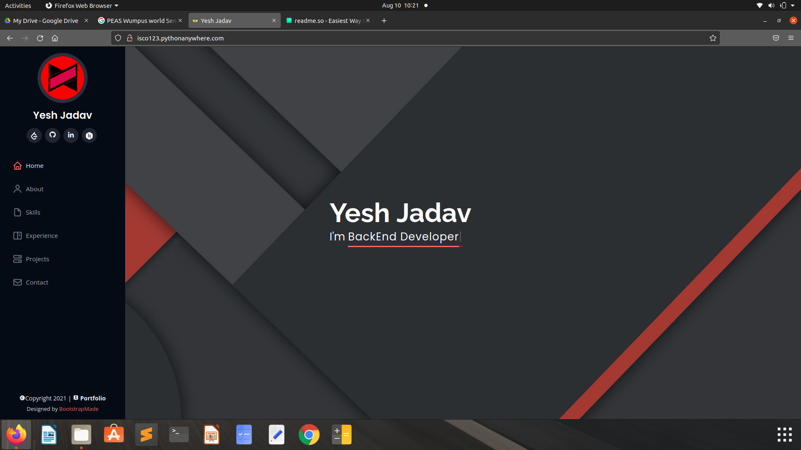
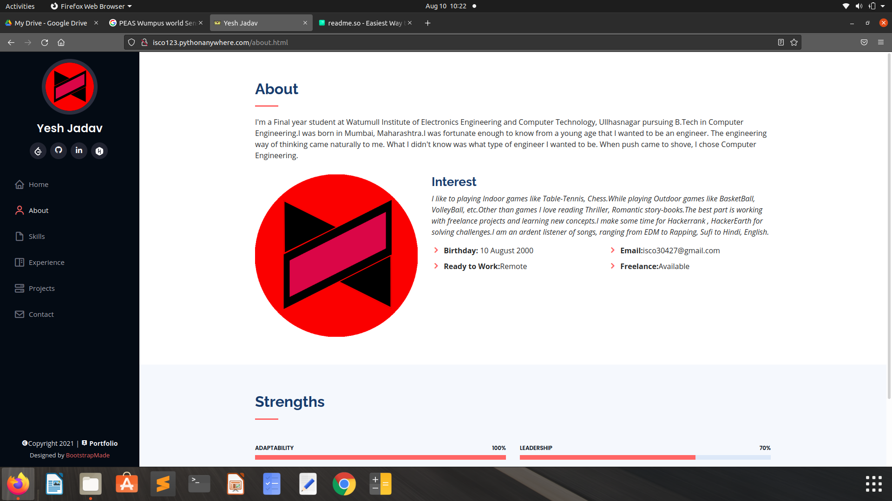
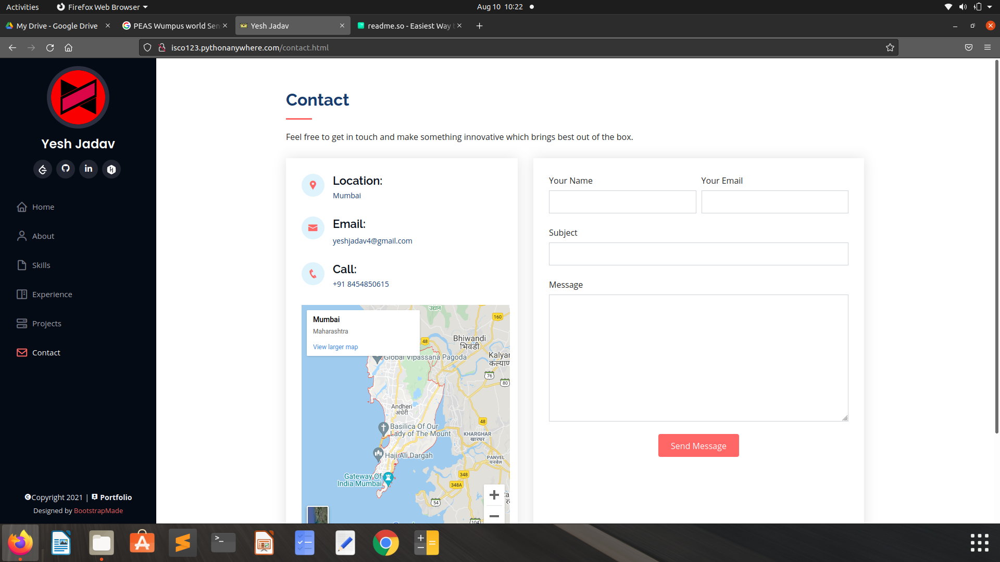

# Portfolio

This project is all about myself you can check it out.

## Installation

Install my-project as zip or clone.

```bash
    git clone https://github.com/Yesh123456/portfolio.git
```
After installing you need to remove port folder.

```bash
    sudo rm -r port
```
Create your environment variable.

```bash
    virtualenv myenv
```
myenv(environment name created) now activate it.(Ubuntu)
```bash
    cd myenv
    source bin/activate
```
Run requirements.txt file.

```bash
    sudo install -r requirements.txt
```

Run flask app.(flask is initialized inside server.py)

```bash
    export FLASK_APP=server
    export FLASK_ENV=developement
    flask app
```


## Features

- Red/Black/White scheme
- Live previews
- Fullscreen mode
- Cross platform

  
## Screenshots







## Feedback

If you have any feedback, please reach out to us at isco30427@gmail.com

  
## Badges

Add badges from somewhere like: [shields.io](https://shields.io/)

[](https://github.com/tterb/atomic-design-ui/blob/master/LICENSEs)
[](https://opensource.org/licenses/)
[](http://www.gnu.org/licenses/agpl-3.0)

  
